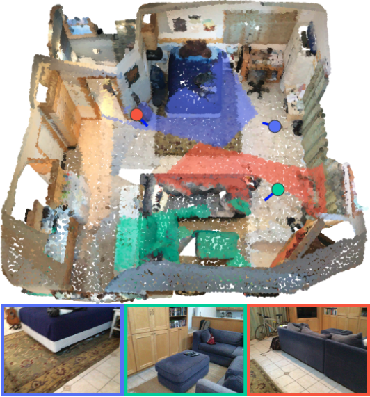
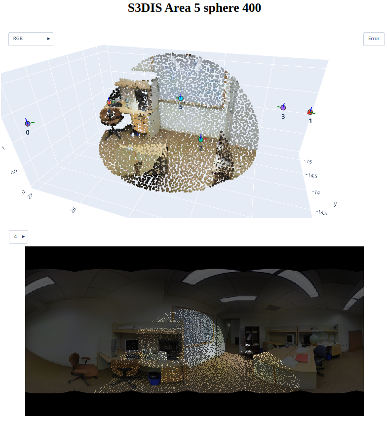

# DeepViewAgg [[CVPR'22 Best Paper Finalist :tada:](https://twitter.com/CVPR/status/1539772091112857600)]
[](https://arxiv.org/abs/2204.07548) | [Paper](https://openaccess.thecvf.com/content/CVPR2022/papers/Robert_Learning_Multi-View_Aggregation_in_the_Wild_for_Large-Scale_3D_Semantic_CVPR_2022_paper.pdf) | [Supplementary](https://openaccess.thecvf.com/content/CVPR2022/supplemental/Robert_Learning_Multi-View_Aggregation_CVPR_2022_supplemental.pdf) | [Project Page](https://drprojects.github.io/deepviewagg) | [Video](https://www.youtube.com/watch?v=SoMKwI863tw) | [Poster](https://drive.google.com/file/d/1vtOLLM4VNV5x57HT-60PbeR9QRiOfX7_/view?usp=sharing) | [CV News](https://www.rsipvision.com/ComputerVisionNews-2022July/24/)

[](https://paperswithcode.com/sota/semantic-segmentation-on-s3dis?p=learning-multi-view-aggregation-in-the-wild) [](https://paperswithcode.com/sota/3d-semantic-segmentation-on-kitti-360?p=learning-multi-view-aggregation-in-the-wild)

Official repository for **_Learning Multi-View Aggregation In the Wild for Large-Scale 3D Semantic Segmentation_** [paper :page_facing_up:](http://arxiv.org/abs/2204.07548) selected for an Oral presentation at CVPR 2022.

<p align="center">
  
</p>

*We propose to exploit the synergy between images and 3D point clouds by learning to select the most relevant views for each point. Our approach uses the viewing conditions of 3D points to merge features from images taken at arbitrary positions. We reach SOTA results for S3DIS (74.7 mIoU 6-Fold) and on KITTI- 360 (58.3 mIoU) without requiring point colorization, meshing, or the use of depth cameras: our full pipeline only requires raw 3D scans and a set of images and poses.*

## Coming soon :rotating_light: :construction:
- **[wandb](https://wandb.ai) logs** of our experiments

## Change log
- 2022-04-20 Added notebooks and scripts to get started with DeepViewAgg
- 2022-04-27 Added pretrained weights and features to help reproduce our results

## Requirements :memo:
The following must be installed before installing this project.
- Anaconda3
- cuda >= 10.1
- gcc >= 7

All remaining dependencies (PyTorch, PyTorch Geometric, etc) should be installed using the provided [installation script](install.sh).

The code has been tested in the following environment:
- Ubuntu 18.04.6 LTS
- Python 3.8.5
- PyTorch 1.7.1
- CUDA 10.2, 11.2 and 11.4
- NVIDIA V100 32G
- 64G RAM

## Installation :bricks:
To install DeepViewAgg, simply run `./install.sh` from inside the repository. 
- You will need to have **sudo rights** to install [MinkowskiEngine](https://github.com/NVIDIA/MinkowskiEngine) and [TorchSparse](https://github.com/mit-han-lab/torchsparse) dependencies.
- :warning: **Do not** install Torch-Points3D from the official repository, or with `pip`.

## Disclaimer
This is **not the official [Torch-Points3D](https://github.com/nicolas-chaulet/torch-points3d) framework**. This work builds on and modifies a fixed version of the framework and has not been merged with the official repository yet. In particular, this repository **introduces numerous features for multimodal learning on large-scale 3D point clouds**. In this repository, some TP3D-specific files were removed for simplicity. 

## Project structure
The project follows the original [Torch-Points3D framework](https://github.com/nicolas-chaulet/torch-points3d) structure.
```bash
├─ conf                    # All configurations live there
├─ notebooks               # Notebooks to get started with multimodal datasets and models
├─ eval.py                 # Eval script
├─ insall.sh               # Installation script for DeepViewAgg
├─ scripts                 # Some scripts to help manage the project
├─ torch_points3d
    ├─ core                # Core components
    ├─ datasets            # All code related to datasets
    ├─ metrics             # All metrics and trackers
    ├─ models              # All models
    ├─ modules             # Basic modules that can be used in a modular way
    ├─ utils               # Various utils
    └─ visualization       # Visualization
└─ train.py                # Main script to launch a training
```

Several changes were made to extend the original project to multimodal learning on point clouds with images. 
The most important ones can be found in the following:
- `conf/data/segmentation/multimodal`: configs for the 3D+2D datasets.
- `conf/models/segmentation/multimodal`: configs for the 3D+2D models.
- `torch_points3d/core/data_transform/multimodal`: transforms for 3D+2D data.
- `torch_points3d/core/multimodal`: multimodal data and mapping objects.
- `torch_points3d/datasets/segmentation/multimodal`: 3D+2D datasets (eg S3DIS, ScanNet, KITTI360).
- `torch_points3d/models/segmentation/multimodal`: 3D+2D architectures.
- `torch_points3d/modules/multimodal`: 3D+2D modules. This is where the DeepViewAgg module can be found.
- `torch_points3d/visualization/multimodal_data.py`: tools for interactive visualization of multimodal data.

## Getting started :rocket:
Notebook to create synthetic toy dataset and get familiar with 2D-3D mappings construction :
- `notebooks/synthetic_multimodal_dataset.ipynb`

Notebooks to create dataset, get familiar with dataset configuration and produce interactive visualization. 
You can also run inference from a checkpoint and visualize predictions:
- `notebooks/kitti360_visualization.ipynb` (at least **350G** of memory :floppy_disk:)
- `notebooks/s3dis_visualization.ipynb` (at least **400G** of memory :floppy_disk:)
- `notebooks/scannet_visualization.ipynb` (at least **1.3T** of memory :floppy_disk:)

Notebooks to create multimodal models, get familiar with model configuration and run forward and backward passes for debugging:
- `notebooks/multimodal_model.ipynb`

Notebooks to run full inference on multimodal datasets, from a model checkpoint. 
Those should allow you to reproduce our results by using the pretrained models in [Models](#models):
- `notebooks/kitti360_inference.ipynb`
- `notebooks/s3dis_inference.ipynb`
- `notebooks/scannet_inference.ipynb`

Scripts to replicate our paper's best experiments :chart_with_upwards_trend: for each dataset:
- `scripts/train_kitti360.sh`
- `scripts/train_s3dis.sh`
- `scripts/train_scannet.sh`

If you need to go deeper into this project, see the [Documentation](#documentation-books) section.

If you have trouble using these or need reproduce other results from our paper, create an issue or leave me a message :speech_balloon: !

## Models
| Model name | Dataset | mIoU  | :floppy_disk: | :point_down: |
|---|:---:|:---:|:---:|:---:|
| Res16UNet34-L4-early |  S3DIS 6-Fold | 74.7 | 2.0G | [link](https://drive.google.com/file/d/19SgU1f2Ny1du5fRL0d9L1721Gqi1AnsY/view?usp=sharing)  |
| Res16UNet34-PointPyramid-early-cityscapes-interpolate | KITTI-360 | 61.7 Val / 58.3 Test | 339M | [link](https://drive.google.com/file/d/1ucQVJ1cdzwpW6HzthaOqTR1BwTp95vrl/view?usp=sharing) |
| Res16UNet34-L4-early | ScanNet | 71.0 Val | 341M | [link](https://drive.google.com/file/d/1H03540psSjturqerEBJkX5B7R8s6fEba/view?usp=sharing) |

## Documentation :books:
The official documentation of [Pytorch Geometric](https://pytorch-geometric.readthedocs.io/en/latest/index.html) and [Torch-Points3D](https://torch-points3d.readthedocs.io/en/latest/index.html#) are good starting points, since this project largely builds on top of these frameworks. For DeepViewAgg-specific features (*i.e.* all that concerns multimodal learning), the provided code is commented as much as possible, but hit me up :speech_balloon: if some parts need clarification.

## Visualization of multimodal data :telescope:
We provide code to produce interactive and sharable HTML visualizations of multimodal data and point-image mappings:

<p align="center">
  
</p>
 
Examples of such HTML produced on S3DIS Fold 5 are zipped [here](./illustrations/interactive_visualizations.zip) and can be opened in your browser.

## Known issues
- Setting `use_faiss=True` or `use_cuda=True` to accelerate `PCAComputePointwise`, `MapImages` or `NeighborhoodBasedMappingFeatures`. As suggested [here](https://github.com/drprojects/DeepViewAgg/issues/1), one should stick to the CPU-based computation for now.

## Credits :credit_card:
- This implementation of DeepViewAgg largely relies on the [Torch-Points3D framework](https://github.com/nicolas-chaulet/torch-points3d), although not merged with the official project at this point. 
- For datasets, some code from the official [KITTI-360](https://github.com/autonomousvision/kitti360Scripts) and [ScanNet](https://github.com/ScanNet/ScanNet) repositories was used.

## Reference
In case you use all or part of the present code, please include a citation to the following paper:

```
@inproceedings{robert2022dva,
  title={Learning Multi-View Aggregation In the Wild for Large-Scale 3D Semantic Segmentation},
  author={Robert, Damien and Vallet, Bruno and Landrieu, Loic},
  booktitle={Proceedings of the IEEE/CVF Conference on Computer Vision and Pattern Recognition},
  year={2022},
  pages={5575--5584},
  year={2022},
  url = {\url{https://github.com/drprojects/DeepViewAgg}}
}
```
